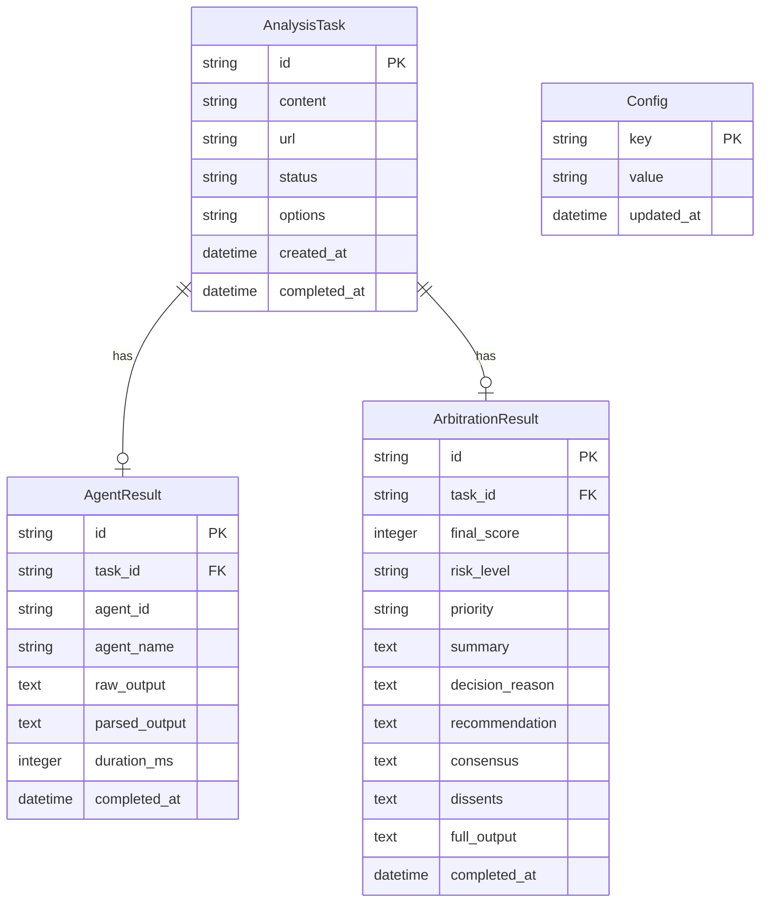

## 1. 架构设计

```C
graph TB
    subgraph "前端层"
        "React App" --> "Zustand Store"
        "React App" --> "API Client"
    end
    subgraph "后端层"
        "Express Server" --> "Agent Orchestrator"
        "Agent Orchestrator" --> "FactChecker"
        "Agent Orchestrator" --> "StanceAnalyst"
        "Agent Orchestrator" --> "EthicsEvaluator"
        "Agent Orchestrator" --> "IntentAnalyst"
        "Agent Orchestrator" --> "SentimentAnalyst"
        "Agent Orchestrator" --> "SensitivityReviewer"
        "Agent Orchestrator" --> "Arbitrator"
    end
    subgraph "外部服务"
        "DeepSeek API" --> "Agent Orchestrator"
    end
    subgraph "数据层"
        "SQLite" --> "Express Server"
    end
    "API Client" --> "Express Server"
```

## 2. 技术说明

* **前端**：React\@18 + Tailwind CSS\@3 + Vite + Zustand

* **初始化工具**：vite-init（react-express-ts 模板）

* **后端**：Express\@4 + TypeScript（ESM）

* **数据库**：SQLite（通过 better-sqlite3）

* **AI 接口**：DeepSeek API（通过 OpenAI SDK 兼容接口）

* **流式传输**：Server-Sent Events (SSE) 用于实时推送角色分析进度

## 3. 路由定义

| 路由                | 用途        |
| ----------------- | --------- |
| `/`               | 新闻提交页（首页） |
| `/roundtable/:id` | 圆桌讨论实时页   |
| `/report/:id`     | 分析报告详情页   |
| `/history`        | 历史记录页     |

## 4. API 定义

### 4.1 提交新闻分析

```
POST /api/analyze
Request: {
  content: string;       // 新闻文本
  url?: string;          // 可选 URL
  options?: {
    enabledAgents?: string[];  // 启用的角色 ID 列表
    depth?: "quick" | "standard" | "deep";  // 分析深度
  }
}
Response: {
  taskId: string;        // 分析任务 ID
}
```

### 4.2 获取分析进度（SSE）

```
GET /api/analyze/:taskId/stream
SSE Events: {
  type: "agent_start" | "agent_progress" | "agent_complete" | "arbitration_start" | "arbitration_complete" | "error";
  agentId?: string;
  agentName?: string;
  content?: string;
  result?: AgentResult;
  progress?: number;
}
```

### 4.3 获取分析报告

```
GET /api/report/:taskId
Response: {
  taskId: string;
  status: "analyzing" | "completed" | "failed";
  input: { content: string; url?: string; submittedAt: string; };
  agents: {
    factChecker: FactCheckResult;
    stanceAnalyst: StanceResult;
    ethicsEvaluator: EthicsResult;
    intentAnalyst: IntentResult;
    sentimentAnalyst: SentimentResult;
    sensitivityReviewer: SensitivityResult;
  };
  arbitration: ArbitrationResult;
  completedAt?: string;
}
```

### 4.4 获取历史记录

```
GET /api/history?page=1&pageSize=20&keyword=&riskLevel=
Response: {
  total: number;
  page: number;
  pageSize: number;
  items: {
    taskId: string;
    summary: string;
    riskLevel: string;
    finalScore: number;
    submittedAt: string;
  }[];
}
```

### 4.5 配置管理

```
GET /api/config
Response: {
  deepseekModel: string;
  enabledAgents: string[];
  depth: string;
}

PUT /api/config
Request: {
  deepseekApiKey?: string;
  deepseekModel?: string;
  enabledAgents?: string[];
  depth?: string;
}
```

## 5. 服务端架构图

```mermaid
graph LR
    "Router" --> "AnalysisController"
    "Router" --> "ReportController"
    "Router" --> "HistoryController"
    "Router" --> "ConfigController"
    "AnalysisController" --> "AgentOrchestrator"
    "AgentOrchestrator" --> "DeepSeekService"
    "ReportController" --> "ReportService"
    "HistoryController" --> "HistoryService"
    "ConfigController" --> "ConfigService"
    "ReportService" --> "Database"
    "HistoryService" --> "Database"
    "ConfigService" --> "Database"
```

## 6. 数据模型

### 6.1 数据模型定义



### 6.2 数据定义语言

```sql
CREATE TABLE analysis_tasks (
  id TEXT PRIMARY KEY,
  content TEXT NOT NULL,
  url TEXT,
  status TEXT NOT NULL DEFAULT 'analyzing',
  options TEXT,
  created_at DATETIME NOT NULL DEFAULT CURRENT_TIMESTAMP,
  completed_at DATETIME
);

CREATE TABLE agent_results (
  id TEXT PRIMARY KEY,
  task_id TEXT NOT NULL REFERENCES analysis_tasks(id),
  agent_id TEXT NOT NULL,
  agent_name TEXT NOT NULL,
  raw_output TEXT,
  parsed_output TEXT,
  duration_ms INTEGER,
  completed_at DATETIME,
  UNIQUE(task_id, agent_id)
);

CREATE TABLE arbitration_results (
  id TEXT PRIMARY KEY,
  task_id TEXT NOT NULL REFERENCES analysis_tasks(id),
  final_score INTEGER,
  risk_level TEXT,
  priority TEXT,
  summary TEXT,
  decision_reason TEXT,
  recommendation TEXT,
  consensus TEXT,
  dissents TEXT,
  full_output TEXT,
  completed_at DATETIME
);

CREATE TABLE config (
  key TEXT PRIMARY KEY,
  value TEXT,
  updated_at DATETIME NOT NULL DEFAULT CURRENT_TIMESTAMP
);

INSERT INTO config (key, value) VALUES ('deepseek_model', 'deepseek-chat');
INSERT INTO config (key, value) VALUES ('enabled_agents', '["fact_checker","stance_analyst","ethics_evaluator","intent_analyst","sentiment_analyst","sensitivity_reviewer"]');
INSERT INTO config (key, value) VALUES ('depth', 'standard');
```

